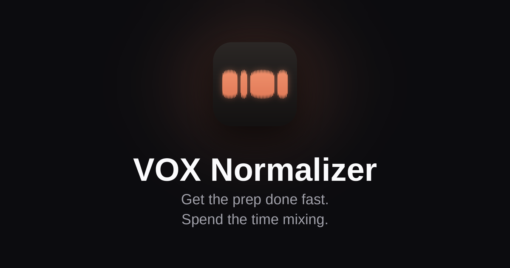

# VOX Normalizer



**Even out the phrase-by-phrase level differences in a vocal take — in one drag and drop.**

A free, open source standalone app for macOS. No DAW required.

[**Download the latest release →**](../../releases/latest) &nbsp;·&nbsp;
[**Website (with a demo you can try in the browser) →**](https://tokyomeltdown.github.io/VOX-Normalizer/)

---

## What it does

Recording a vocal take always leaves you with phrases that are too loud and phrases
that are too quiet. The usual fix is to select each phrase in your DAW and nudge its
clip gain by hand — slow, and easy to get wrong.

VOX Normalizer does that pass for you. Load a take, and it exports **a single audio
file** with each phrase brought to the same RMS level. Your DAW workflow doesn't
change at all: you just get a better starting point before the compressor.

It applies **static gain per phrase**, not dynamic riding. The dynamics *inside* each
phrase are left exactly as performed.

## Features

- **Automatic phrase detection** from silence, with an RMS-window detector and hysteresis
- **Manual boundary editing** — drag any phrase boundary in the waveform, at sample accuracy
- **Peak Ceiling** so a plosive can never push the output into clipping
- **A/B preview** — play the original and the normalized result and switch between them
- **Zoomable waveform** (1x–16x) with per-phrase RMS, gain and status readouts
- **Whole file mode** for material with no clear gaps (karaoke, sustained takes)
- **No hidden conversion** — load a WAV or AIFF and the sample rate, bit depth and
  channel count come back untouched. MP3 is written out as WAV so it is never re-encoded

## Requirements

macOS, universal binary (Apple Silicon and Intel). No DAW needed — it runs standalone.

## Install

1. Download **`VOX_Normalizer.pkg`** from [Releases](../../releases/latest)
2. Double-click it and follow the installer — the app is placed in `/Applications`

The installer and the app are both signed with a Developer ID and notarized by
Apple, so no Gatekeeper warning should appear.

## Building from source

Requires [JUCE](https://juce.com) 8.0.12 or later and Xcode.

```bash
# Debug build (Standalone only)
bash build.sh

# Release: Developer ID signing + notarization, then a signed & notarized installer
bash notarize.sh
bash make_pkg.sh
```

`build.sh` expects the Projucer at `~/Documents/JUCE/Projucer.app`. The signing and
notarization scripts contain identifiers specific to this project's Apple Developer
account, so you will need to edit them for your own.

Only the **Standalone** format is built. AAX support was removed in v1.2.

## Licence

VOX Normalizer is licensed under the **GNU Affero General Public License v3.0**.
See [LICENSE](LICENSE) for the full text.

This project uses the [JUCE](https://github.com/juce-framework/JUCE) framework under
the terms of the **AGPLv3**, which is one of the two licences JUCE is offered under.
If you build a derivative work, note that the AGPLv3 route cannot be used for the
AAX, VST2, AUv3 or iOS targets — that is why this project ships Standalone only.

---

# VOX Normalizer（日本語）

**ボーカルのフレーズごとの音量を、ドラッグ1つでそろえる。**

macOS 向けの無料・オープンソースのスタンドアロンアプリです。DAW は不要です。

[**最新版のダウンロードはこちら →**](../../releases/latest) &nbsp;·&nbsp;
[**紹介ページ（ブラウザで動くデモつき）→**](https://tokyomeltdown.github.io/VOX-Normalizer/)

## 何をするもの？

ボーカルを録ると、必ず大きすぎるフレーズと小さすぎるフレーズが出ます。ふつうは
DAW でフレーズを1つずつ選んでクリップゲインを手で上下させますが、これが地味に
時間を食いますし、精度もばらつきます。

VOX Normalizer はその作業を代わりにやります。テイクを読み込むと、各フレーズを
同じ RMS レベルにそろえた**1本のオーディオファイル**を書き出します。DAW の作業
手順は何も変わりません。コンプの前段の「下ごしらえ」が済んだ状態から始められる
だけです。

かけるのは**フレーズ単位の静的なゲイン**で、レベルライダーのような動的処理では
ありません。フレーズ**内側**のダイナミクスは歌ったままの形で残ります。

## 主な機能

- 無音を区切りとした**フレーズ自動検出**（RMS 窓方式・ヒステリシス付き）
- 波形上で**境界を手動ドラッグ**して微調整（サンプル精度）
- **Peak Ceiling** — 破裂音で出力がクリップすることを防ぎます
- **A/B プレビュー** — 元音とノーマライズ後を切り替えて聴き比べ
- **ズーム可能な波形**（1〜16倍）。フレーズごとの RMS・ゲイン・ステータスを表示
- 切れ目のない素材向けの **Whole file モード**（カラオケなど）
- **余計な変換なし** — WAV と AIFF は、サンプルレート・ビット深度・チャンネル数を
  そのまま書き出します。MP3 を読み込んだときだけは、再エンコードで劣化させないために
  WAV で書き出します

## 動作環境

macOS（Apple Silicon・Intel 両対応のユニバーサルバイナリ）。DAW は不要です。

## インストール

1. [Releases](../../releases/latest) から **`VOX_Normalizer.pkg`** をダウンロード
2. ダブルクリックしてインストーラーの指示に従うだけです（`/Applications` に入ります）

インストーラーとアプリの両方に Developer ID 署名と Apple の公証を済ませてあるので、
Gatekeeper の警告は出ません。

## ライセンス

**GNU Affero General Public License v3.0** です。全文は [LICENSE](LICENSE) を
参照してください。

本プロジェクトは [JUCE](https://github.com/juce-framework/JUCE) を **AGPLv3** の
条項で利用しています（JUCE はデュアルライセンスで、AGPLv3 はその片方です）。
派生物を作る場合の注意として、AGPLv3 の条項は AAX / VST2 / AUv3 / iOS の
ターゲットには使えません。本プロジェクトが Standalone のみを配布しているのは
このためです。

---

Made by [tokyomeltdown](https://tokyomeltdown.github.io)
