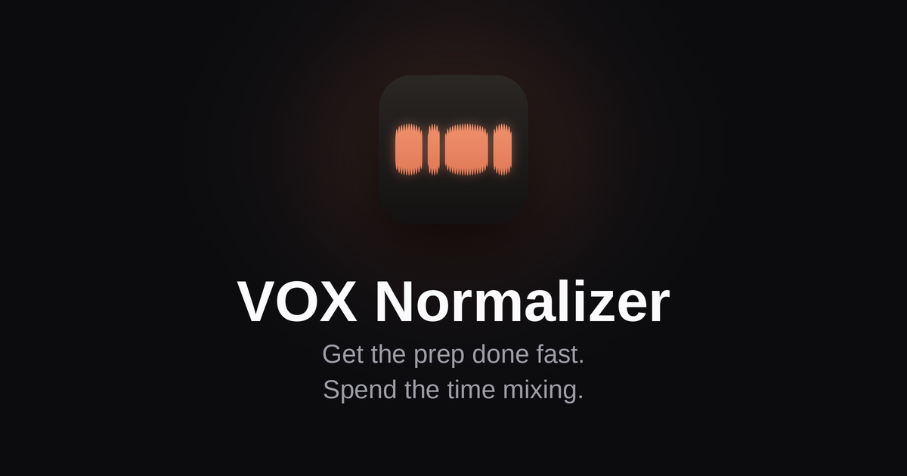

# VOX Normalizer



**Even out the phrase-by-phrase level differences in a vocal take — in one drag and drop.**

A free, open source standalone app for macOS. No DAW required.

[**Download the latest release →**](../../releases/latest) &nbsp;·&nbsp;
[**Website (with a demo you can try in the browser) →**](https://tokyomeltdown.github.io/VOX-Normalizer/)

[日本語のREADMEはこちら / Japanese README](README.ja.md)

---

## What it does

Recording a vocal take always leaves you with phrases that are too loud and phrases
that are too quiet. The usual fix is to select each phrase in your DAW and nudge its
clip gain by hand — slow, and easy to get wrong.

VOX Normalizer does that pass for you. Load a take, and it exports **a single audio
file** with each phrase brought to the same RMS level. Your DAW workflow doesn't
change at all: you just get a better starting point before the compressor.

It applies **static gain per phrase**, not dynamic riding. The dynamics *inside* each
phrase are left exactly as performed.

## Features

- **Automatic phrase detection** from silence, with an RMS-window detector and hysteresis
- **Manual boundary editing** — drag any phrase boundary in the waveform, at sample accuracy
- **Peak Ceiling** so a plosive can never push the output into clipping
- **A/B preview** — play the original and the normalized result and switch between them
- **Zoomable waveform** (1x–16x) with per-phrase RMS, gain and status readouts
- **Whole file mode** for material with no clear gaps (karaoke, sustained takes)
- **No hidden conversion** — load a WAV or AIFF and the sample rate, bit depth and
  channel count come back untouched. MP3 is written out as WAV so it is never re-encoded.
  A WAV's BWF time stamp is kept too, so the file spots back to its original position

## Requirements

macOS 11 or later, universal binary (Apple Silicon and Intel). No DAW needed — it runs standalone.

## Install

1. Download **`VOX_Normalizer.pkg`** from [Releases](../../releases/latest)
2. Double-click it and follow the installer — the app is placed in `/Applications`

The installer and the app are both signed with a Developer ID and notarized by
Apple, so no Gatekeeper warning should appear.

## Building from source

Requires [JUCE](https://juce.com) 8.0.12 or later and Xcode.

```bash
# Debug build (Standalone only)
bash build.sh

# Release: Developer ID signing + notarization, then a signed & notarized installer
bash notarize.sh
bash make_pkg.sh
```

`build.sh` expects the Projucer at `~/Documents/JUCE/Projucer.app`. The signing and
notarization scripts read the signing identity from `$SIGNER` or `~/.config/tokyomeltdown/signer`,
and use the notarytool profile named in `NOTARY_PROFILE`; set both up for your own account.

Only the **Standalone** format is built. AAX support was removed in v1.2.

Regression tests for the processing live in [`tests/`](tests/README.md).

## Licence

VOX Normalizer is licensed under the **GNU Affero General Public License v3.0**.
See [LICENSE](LICENSE) for the full text.

This project uses the [JUCE](https://github.com/juce-framework/JUCE) framework under
the terms of the **AGPLv3**, which is one of the two licences JUCE is offered under.
If you build a derivative work, note that the AGPLv3 route cannot be used for the
AAX, VST2, AUv3 or iOS targets — that is why this project ships Standalone only.

---

Made by [tokyomeltdown](https://tokyomeltdown.github.io)
